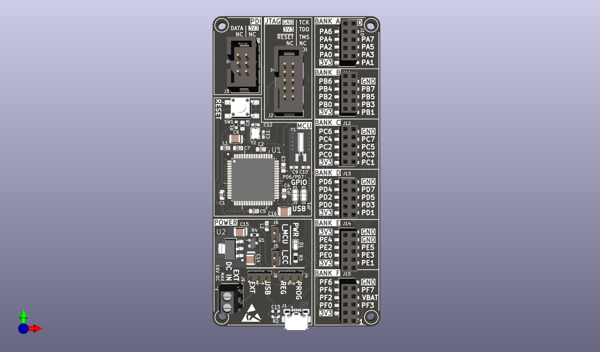
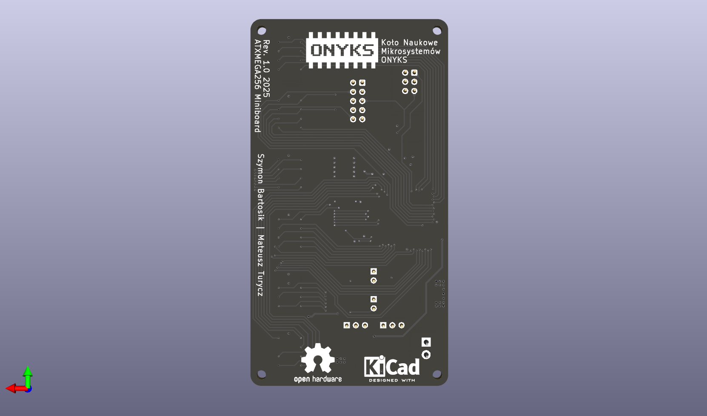

# ONYKS ATXMEGA256 Miniboard
Miniboard to prosta płytka deweloperska stworzona dla mikrokontrolera ATXMEGA256 przez KN ONYKS. Płytka zawiera możliwie minimalną liczbę elementów potrzebnych do zaczęcia programowania tego mikrokontrolera aby użytkownik miał pełną kontrolę nad swoim projektem.

 
 

## TODO

- [x] Schemat połączeń MCU
- [x] Schemat sekcji zasilania
- [x] PCB
- [x] Dokumentacja - schematy, PCB, zdjęcia
- [ ] Dokumentacja - instrukcja obsługi
- [x] Dokumentacja - BOM
- [ ] Toolchain
- [x] Modele 3D
- [ ] Rysunek techniczny (poglądowy)

## Autorzy
Szymon Bartosik, Mateusz Turycz
